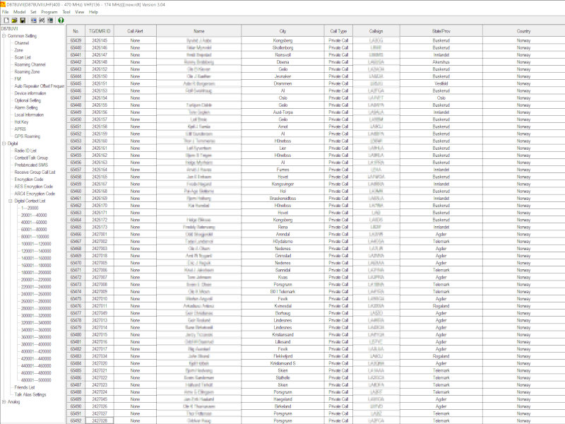

# AnyTone D878 II Plus - Digital Contacts for Norway

This project provides two Python scripts for managing and processing DMR and Norwegian amateur radio contact data. The scripts handle downloading, updating, and merging contact information. The generated digital_contacts_list.csv can be imported using your CPS.


## Overview

1. **`download-users.py`**  
   Downloads the latest DMR and Norwegian amateur radio databases if there are updates. Metadata, such as Last-Modified timestamp and MD5 hash, is stored to minimize unnecessary downloads.

2. **`create-contacts.py`**  
   Merges the DMR and Norwegian data into a single file, `digital_contacts_list.csv`. It standardizes names, cities, and adds location data based on postal codes.

## Files

- **`download-users.py`**: Downloads contact databases.
- **`create-contacts.py`**: Processes and merges contact data.
- **`user.csv`**: DMR contact database.
- **`user-no.csv`**: Norwegian amateur radio contact database.
- **`digital_contacts_list.csv`**: Consolidated contact list output.
- **`user.meta`** & **`user-no.meta`**: Metadata files for tracking download information.

## Setup and Usage

### Requirements

- Python 3.x
- Libraries: `requests`, `logging`, `csv`, `argparse`

### Installation

Clone the repository:

```bash
git clone https://github.com/gujord/AnyTone-D878-II-Plus-Digital-Contacts-Norway.git
cd AnyTone-D878-II-Plus-Digital-Contacts-Norway
```

### Usage

1. **Download User Data**  
   To download contact data, run:
   ```bash
   python download-users.py
   ```
   Use `-f` or `--force` to download regardless of the Last-Modified date.

2. **Create Contacts List**  
   After downloading, run:
   ```bash
   python create-contacts.py
   ```
   This generates the `digital_contacts_list.csv` file.

## License

Licensed under the BSD 3-Clause License.

## Contributions

Contributions are welcome. Please open an issue or submit a pull request.

